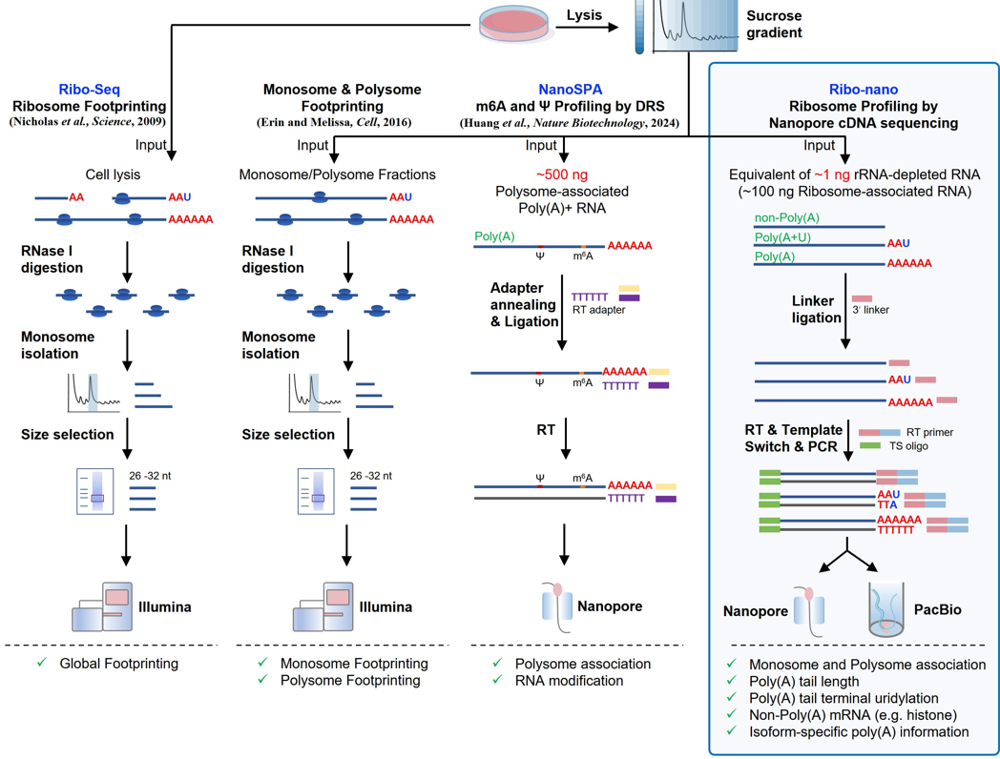

# pipeline of analyzing Ribo-nano

___


___
## 0.Preparation
### packages install

- Python version
Python 3.8.18 and above


- recommand using conda to install all packages

  - `conda create -n Ribo_nano_env python >= 3.8`
  - `conda activate Ribo_nano_env`
  - `conda install -c bioconda -c conda-forge matplotlib scipy numpy pandas pysam seaborn cycler bowtie cutadapt hdf5 htseq jedi samtools bedtools star subread gffread sh adjusttext bzip2 pigz six tqdm svg-stack ` 


- This command will create a environment: `Ribo_nano_env`
- FLEPSeq2 environment is required
  https://github.com/ZhaiLab-SUSTech/flep_seq2_polya_analysis

___
## 1 Nanopore bascalling and obtain the treanscript termination intermediates

### 1.1 Basecalling
```shell
guppy_basecaller -i {fast5_dir} -s {pass_fast5_dir} -c {model} --recursive --fast5_out --disable_pings --qscore_filtering --device {params_cuda}
```

- `{fast5_dir}: directory of raw fast5`
- `{pass_fast5_dir}: directory of output fast5`
- `{model}: type of sample (DNA or RNA) experimental apparatus ,reagents. ex. dna_r9.4.1_450bps_hac.cfg`
- `{params_cuda}: GPU and cuda version. ex. "cuda:all:100%"`

- `tips: Parameters may be different for different versions of guppy, so please pay attention to modify them.`


### 1.2 Transfer fastq to fasta
```shell
python fastqdir2fasta.py --indir {fastq_dir} --out {fasta_file}
```

- `{fastq_dir}: directory of fastq, generated by bascalling.`
- `{fasta_file}: output fasta file, recommand to store this in new a directory.`


### 1.3 Mapping process
```shell
minimap2 -t {threads} -ax splice --secondary=no -G 12000 {genome} {fasta_file} -o {mediate_sam}
samtools view -@ {threads} -F 2308 -hb {mediate_sam} {mediate_bam}
samtools sort -@ {threads} -O bam -o {sort_bam} {mediate_bam}
samtools index -@ {threads} {sort_bam}
```

- `{threads}: The number of threads`
- `{genome}: The genome of fasta format`

- `tips: Parameters may be different for different versions of samtools. The sorted bam will generate, and you can delete the sam file after checking that the output file is correct.`


### 1.4 Find 3'linker
```shell
python adapterFinder.py --inbam {input_bam} --inseq {fasta_file} --out {adapter} --threads {threads} --mode 1
```

- `{adapter}: File contain the adapter's relative location and other infromation on coressponding read.`


### 1.5 Identify and estimate the poly(A) tail
```shell
python PolyACaller.py --inadapter {adapter} --summary {sequencing_summary}  --fast5dir {pass_fast5_dir} --out {polyA_tail} --threads {threads}
```

- `{sequencing_summary}: Sequencing summary file is generated by basecalling step.`
- `{polyA_tail}: Output result of poly(A) tail result.`


### 1.6 Extract read information
```shell
python extract_read_info.py --inbed {bed} --inbam {sort_bam} --out {read_info}
```

- `{read_info}: Extraction of information based on read and relative position of exons and introns on the genome.`

___
## 2. Analyzing `Ribo-nano (monosome~polysome *n+*)` by jupyterlab
- `run main1_jupyterlab_code.ipynb in the jupyterlab enviroment`


___
## 3. Analyzing `Ribo-seq profiling` by jupyterlab
- `run main2_jupyterlab_code.ipynb in the jupyterlab enviroment`


___
## Detailed information about this project
- URL: *url*
  - *Please cite this article when using this software*
